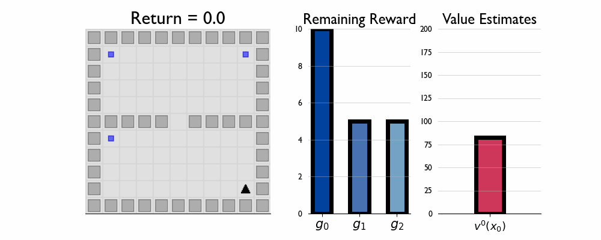

# A State Representation for Diminishing Rewards

Here we present GIFs of agents trained using the &lambda;R across several navigation domains. A consistent theme is that accurate policy evaluation using the ``correct'' &lambda; leads to stronger performance. Using a &lambda; which is too high typically leads to overstaying at reward locations, while a &lambda; which is too low leads the agent to abandon rewarded locations too early. 

## Policy Learning in TwoRooms

## Policy Composition in FourRooms

## Replenishing Rewards in TwoRooms

